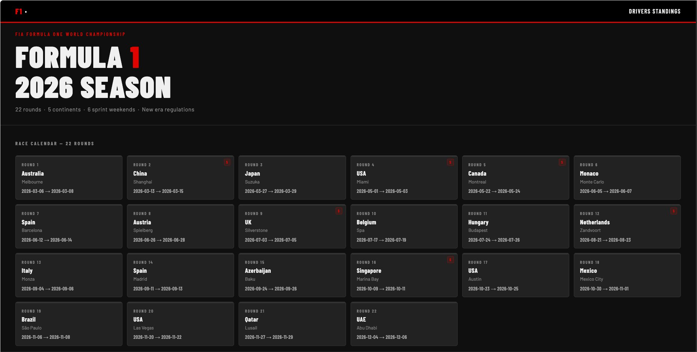

# f1-race-analytics

An analytics platform for F1 races and historical data.

**Live:** https://f1-race-analytics.fastapicloud.dev/



---

## What this is

A Python F1 race analytics platform built as a portfolio project. It ingests
historical race data from the Jolpica F1 API, serves it through a FastAPI web
app with Jinja2 dashboards, and streams simulated live race positions over
Server-Sent Events using Datastar.

The intent is to demonstrate modern Python tooling, FastAPI architecture
(including a Repository Pattern for data sources), thoughtful data modeling
(3-way association table), async streaming, and disciplined development
workflow (scoped PRs, scoped issues, env-var-gated features).

---

## Tech stack

| Concern | Choice |
|---|---|
| Project management | uv (Python 3.13, lockfile-based) |
| Web framework | FastAPI (two separate apps — see Architecture) |
| ORM | SQLModel |
| Database | SQLite (file: `database.db`) |
| Templates | Jinja2 |
| Live streaming | Datastar + Server-Sent Events |
| HTTP client | httpx (for Jolpica API) |
| Config | python-decouple |
| Type checker | ty |
| Tests | pytest + pytest-cov |

---

## Architecture

Two FastAPI applications, deliberately split:

- **`app.py` — main analytics app, port 8000.** Race calendar, race results,
  drivers standings. Reads historical data from the Jolpica F1 API on startup
  (lifespan handler clears and rebuilds the SQLite schema on every restart).
  This is the app deployed to FastAPI Cloud.

- **`live_api.py` — live race SSE app, port 8001.** Streams positions to a
  Datastar-powered replay dashboard. Local-development only; gated out of
  production via the `REPLAY_URL` env var (unset in prod → nav link hidden,
  `/replay` route 404s).

Backend data source for the live app uses the **Repository Pattern** in
`datasources/`:

- `base.py` — `RaceDataSource` ABC + `Position` dataclass.
- `fake.py` — `FakeDataSource` driven by a `RaceSimulator` that swaps
  adjacent positions every ~3s with cumulative change tracking.
- `sportmonks.py` — stub. Raises `NotImplementedError` from `__init__` so
  misconfigured environments fail loudly at startup rather than mid-stream.
- `data_source.py` — factory; routes on `DATA_SOURCE` env var.

### Endpoints

**Main app (port 8000)**

| Route | Renders |
|---|---|
| `GET /` | Season calendar with race cards |
| `GET /results/{circuit_id}` | Race result table |
| `GET /standings/drivers` | Drivers' championship standings |
| `GET /replay` | Replay dashboard (404s if `REPLAY_URL` unset) |

**Live app (port 8001) — local only**

| Route | Behavior |
|---|---|
| `GET /live/stream?fixture_id=...` | SSE endpoint, pushes positions every ~3s |

---

## Running locally

Requires Python 3.13 and [uv](https://docs.astral.sh/uv/).

```bash
# Install dependencies
uv sync

# Run the main app (port 8000)
uv run fastapi dev app.py

# In a second terminal, run the live API (port 8001) for the replay dashboard
uv run fastapi dev live_api.py --port 8001
```

Set `REPLAY_URL` in your local environment to enable the replay dashboard nav
link and route. Leave it unset to mirror production behavior.

Run the test suite:

```bash
uv run pytest
```

---

## Deployment

Deployed to FastAPI Cloud from `main` via `fastapi deploy`.

Only the main app (`app.py`) is deployed — the live API is local-development
only. The deployed app will not co-deploy the live API; the eventual
production live feature will fetch from a real data provider (Sportmonks,
planned), making the second-process setup unnecessary.

The `REPLAY_URL` env var pattern means the same code runs locally and in
production with no comment-toggling. Locally set → fully working dashboard.
Unset in prod → graceful degradation (link hidden, route 404s).

---

## Roadmap

- [ ] Fix `fp1_date` / `has_sprint` fixture errors so `pytest` passes cleanly,
      and add a GitHub Action to run `pytest` on every push
- [ ] Constructors standings page (mirrors the drivers standings pattern)
- [ ] Inline-styles refactor across templates
- [ ] Sportmonks integration as a real `RaceDataSource` implementation
- [ ] Auto-deploy on push to `main` (FastAPI Cloud GitHub integration if
      available, otherwise a `fastapi-cloud-cli` Action) — gated behind
      the test suite landing first
- [ ] End-to-end smoke tests against the deployed URL covering home,
      standings, results, and the `/replay` 404 in production
